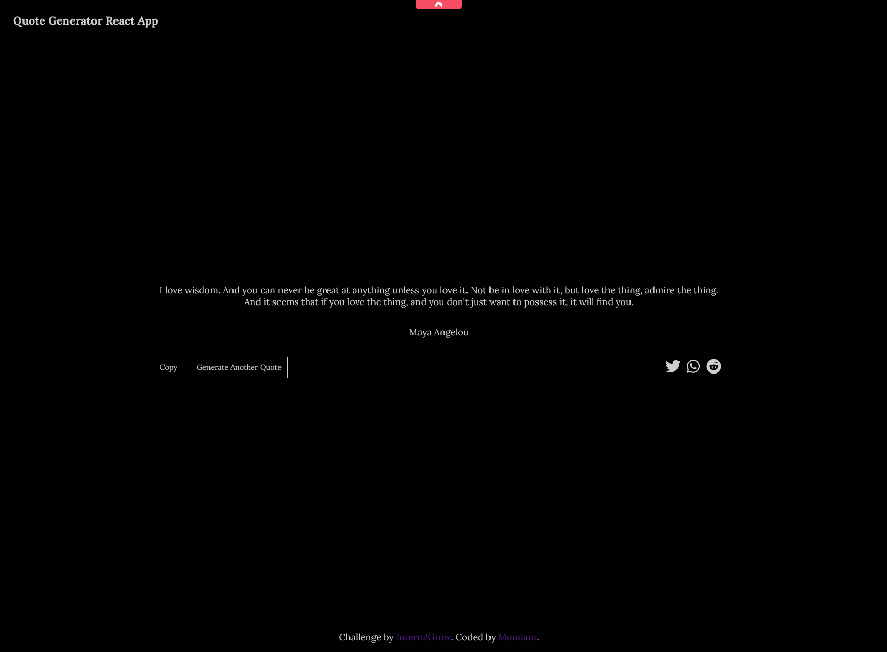

# Intern2Grow - Quote Generator

This is a solution to the [Quote Generator task on intern2grow](https://www.frontendmentor.io/challenges/calculator-app-9lteq5N29). 
First Task is part of Inter2Grow React.js Developer Program

## Table of contents

- [Intern2Grow - Quote Generator](#intern2grow---quote-generator)
  - [Table of contents](#table-of-contents)
  - [Overview](#overview)
    - [The challenge](#the-challenge)
    - [Screenshot](#screenshot)
    - [Links](#links)
  - [My process](#my-process)
    - [Built with](#built-with)
  - [Author](#author)
  - [Acknowledgments](#acknowledgments)

## Overview

### The challenge

Users should be able to:

- Generate new Quotes
- Copy Quote and Author to clipboard
- Share Quote on Twitter, Whatsapp and Reddit

### Screenshot

### Links

- Live Site URL: [Live Site](https://quote-generator-mt.netlify.app/)

## My process

### Built with

- Semantic HTML5 markup
- CSS custom properties
- Flexbox
- CSS Grid
- Mobile-first workflow
- [React](https://reactjs.org/) - JS library
- [React Icons](https://react-icons.github.io/react-icons) - React Icons Libary

## Author

- Website - [Mondara](https://mondarathotage.com/)
- Linkedin - [@Mondara](https://www.linkedin.com/in/mondara-thotage/)
- Github - [@Mondara](https://github.com/Mondara)

**Note: Delete this note and add/remove/edit lines above based on what links you'd like to share.**

## Acknowledgments

The design is from [Nina Armangué Braun](https://dribbble.com/shots/15354779-Quote-Generator) Quote Generator Website on figma.
